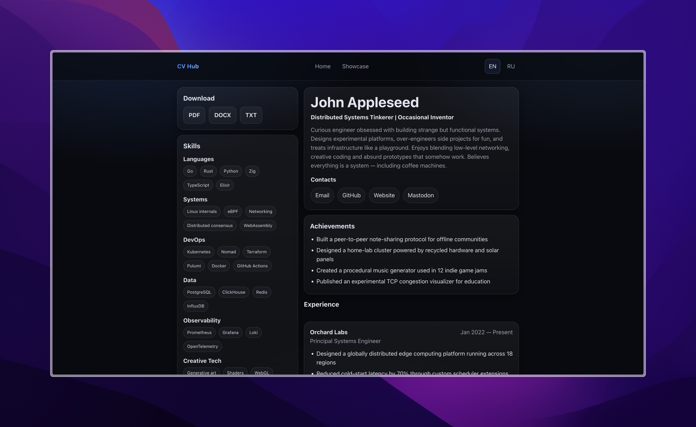

# CV Hub


**Resume as Code. Reproducible. Versioned. Deployable.**

CV Hub turns your resume into infrastructure.

One YAML file becomes:

- A live personal website
- Downloadable PDF, DOCX and TXT files
- A structured, version-controlled professional profile
- A reproducible build artifact

No duplicated resumes. No platform lock-in. No visual builders.

Just data → build → deploy.

Treat your career like a system.

## Preview



🌐 **Live demo:** https://keegooroomie.github.io/cv_hub/

---

## Who is this for

CV Hub works for anyone who wants a professional website with full personal control:

- Developers, DevOps engineers, designers, managers, analysts — any specialist
- Anyone tired of Tilda, Notion, Canva, and other platforms
- Anyone who wants to version their resume with Git and automate format generation

> Minimum requirement — basic familiarity with the command line and Git. If you can clone a repo and edit text files, that's enough.

---

## What you get

- Main page — CV
- Showcase page — projects and case studies
- Two language support (RU / EN)
- Downloadable resume files (PDF / DOCX / TXT) generated automatically from YAML
- Clean static HTML deployed on GitHub Pages
- Full control over the visual style through a single CSS file

---

## Why this exists

Most people maintain:
- A PDF resume
- A LinkedIn profile
- A portfolio site
- A Notion page
- A DOCX file somewhere on their desktop

They all drift out of sync.

CV Hub eliminates duplication and centralizes everything into one structured source of truth.

Edit once. Regenerate everything. Commit changes. Deploy.

This is especially powerful for engineers, DevOps, and technical specialists who prefer automation over manual editing.

---

## Quick start

From zero to live site in under 5 minutes.

### 1. Fork the repository

Click **Fork** in the top right corner of the repository page on GitHub.

After forking you'll have your own copy: `github.com/YOUR_ACCOUNT/cv-hub`

### 2. Clone to your local machine

```bash
git clone https://github.com/YOUR_ACCOUNT/cv-hub.git
cd cv-hub
```

### 3. Install dependencies

```bash
npm install
npx playwright install chromium --with-deps
```

### 4. Run locally

```bash
npm run dev
```

The site will be available at:

```
http://localhost:4321
```

Pages:
- `http://localhost:4321/` — main CV page
- `http://localhost:4321/showcase` — projects showcase

---

## How to edit your data

All data is stored in YAML files inside `src/content/`.

```
src/content/
  cv/
    en.yaml       ← CV in English
    ru.yaml       ← CV in Russian
  showcase/
    projects.yaml ← projects list
```

For full YAML structure reference and field descriptions — see **[`docs/INFO.md`](docs/INFO.md)**.

---

## How to fill in your data

There are three ways to get your resume into YAML:

### Option A — Edit YAML directly

Open `src/content/cv/en.yaml` and `ru.yaml` and fill in your data manually.
See [`docs/INFO.md`](docs/INFO.md) for the full field reference.

### Option B — Import from JSON Resume

If your resume exists in [JSON Resume](https://jsonresume.org) format:

```bash
# Single language
npm run resume:import -- docs/cv_en.json en
npm run resume:import -- docs/cv_ru.json ru

# Both at once
npm run resume:import:all
```

### Option C — Generate from any resume via LLM

If you have a PDF, DOCX, or plain text resume — use Claude or ChatGPT with the ready-made prompt to generate YAML automatically.

👉 **[See `docs/llm-resume-guide.md`](docs/llm-resume-guide.md)**

---

## How to customize the look

All styles live in one file:

```
public/styles/global.css
```

The file is token-based — to change the color scheme of the entire site, just edit the `:root` block at the top:

```css
:root {
  --bg: #0b0f14;          /* background color */
  --surface: #0f1620;     /* card background */
  --text: #e9eef7;        /* primary text */
  --muted: #a6b1c2;       /* secondary text */
  --accent: #3b82f6;      /* accent color (blue by default) */
  --accent-2: #60a5fa;    /* secondary accent / hover */
}
```

Change one variable — the whole site updates. Dark theme is used by default.

---

## How to deploy to GitHub Pages

### 1. Enable GitHub Pages in repository settings

`Settings → Pages → Source: GitHub Actions`

### 2. Push your changes

```bash
git add .
git commit -m "update cv data"
git push
```

Your site will be live at:

```
https://YOUR_ACCOUNT.github.io/cv-hub/
```

The deploy workflow runs automatically on every push to `main`. The `base` URL is resolved dynamically from `GITHUB_REPOSITORY` — so forks work out of the box without any config changes.

---

## Resume file generation

All resume files are generated automatically from YAML during build:

```bash
npm run build
```

This runs in order:
1. `resume:generate` — builds DOCX + TXT from YAML
2. `resume:pdf` — builds PDF via Playwright from YAML
3. `astro build` — builds the static site

Output:
```
public/downloads/resume_en.pdf
public/downloads/resume_ru.pdf
public/downloads/resume_en.docx
public/downloads/resume_ru.docx
public/downloads/resume_en.txt
public/downloads/resume_ru.txt
```

To generate resume files without building the site:

```bash
npm run resume:generate   # DOCX + TXT
npm run resume:pdf        # PDF
```

---

## CLI reference

```bash
npm run dev                  # start local dev server
npm run build                # generate all resume files + build site
npm run resume:generate      # generate DOCX + TXT from YAML
npm run resume:pdf           # generate PDF from YAML via Playwright
npm run resume:import        # convert JSON Resume → YAML (single file)
npm run resume:import:all    # convert both cv_en.json and cv_ru.json
npm run resume:linkedin      # parse LinkedIn PDF export → YAML (best-effort)
```

---

## Documentation

```
docs/
  INFO.md                ← Project overview, YAML reference, data flow
  ENGINEERING.md         ← Engineering decisions and project philosophy
  llm-resume-guide.md    ← How to generate YAML from a resume using an LLM
```

**`INFO.md`** — start here if you want to understand the project or adapt it. Covers goals, architecture, full YAML schema with examples, and component structure.

**`ENGINEERING.md`** — architectural journal. Explains why Astro over React or Angular, why YAML, what trade-offs were made deliberately.

---

## Project structure

```
src/
  content/
    cv/
      en.yaml
      ru.yaml
    showcase/
      projects.yaml
  pages/
    index.astro              # Main CV page (EN)
    ru.astro                 # Main CV page (RU)
    showcase/
      index.astro            # Showcase page (EN)
      ru.astro               # Showcase page (RU)
  components/
    Layout.astro
    Header.astro
    HomePage.astro
  scripts/
    resume-export-pdf.mjs    # PDF generator (Playwright)
    resume-import-json.mjs   # JSON Resume → YAML converter
    resume-import-linkedin.mjs # LinkedIn PDF → YAML parser
public/
  styles/
    global.css               # All site styles
  downloads/                 # Generated resume files
.github/
  scripts/
    generate-resume.js       # DOCX + TXT generator
  workflows/
    deploy.yml               # GitHub Actions CI/CD
docs/
  INFO.md
  ENGINEERING.md
  llm-resume-guide.md
```

---

## Tech stack

- [Astro](https://astro.build) — static site generator
- YAML — single source of truth
- [docx](https://docx.js.org) — DOCX generation
- [Playwright](https://playwright.dev) — PDF generation
- GitHub Pages — deployment
- GitHub Actions — CI/CD

---

## License

Source code: MIT  
Content (resume data): © Author